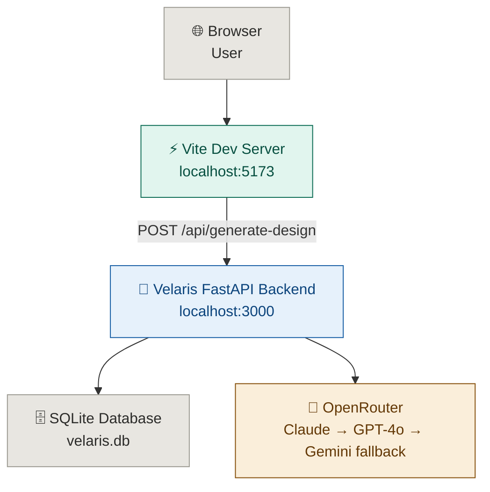

<div align="center">

[](https://github.com/ria0304/Velaris-From-Inspiration-to-Jewellery-Design)


# Velaris — From Inspiration to Jewellery Design

**Type it. Sketch it. Upload it. Get a jewellery design you can actually build.**

VELARIS AI transforms natural language descriptions, sketches, or inspiration photos into professional design concepts, manufacturer-ready spec sheets, and exportable PDFs — powered by a multi-model AI fallback chain.

</div>

---

## The Problem

Custom jewellery design is slow, expensive, and built on miscommunication.

**Customers** struggle to describe what they want clearly, visualise the final piece, or understand costs before committing.

**Jewellers** spend hours interpreting vague briefs, creating multiple drafts, and handling revisions — before a single piece is made.

---

## The Solution

VELARIS AI bridges the gap between a customer's idea and a jeweller's workflow.

A user inputs their idea in one of three ways:

- **Text** — describe the piece in plain language
- **Sketch** — upload a rough hand-drawn drawing
- **Photo** — upload an inspiration image

The system outputs:

- A **type-accurate visual concept** (ring, necklace, earrings, bracelet, brooch, tiara — each rendered differently)
- A **structured specification sheet** (type, metal, stone, cut, style, setting, occasion, sizing, cost breakdown)
- **Dynamic manufacturing notes** specific to the chosen metal, setting type, and complexity score
- An **exportable PDF** the jeweller can use to quote and manufacture

---

## Core User Flow

```
User input (text / sketch / photo)
        ↓
OpenRouter AI (Claude → GPT-4o → Gemini fallback chain)
        ↓
Structured spec + multi-view narrative
        ↓
Type-accurate SVG visualiser (Ring / Necklace / Earrings / Bracelet / Brooch / Tiara)
        ↓
Dynamic manufacturing notes (metal + setting + complexity)
        ↓
Exportable PDF → Jeweller
```

---

## Features

| Feature | Status |
|---|---|
| Text / sketch / photo input | ✅ |
| Multi-model AI fallback chain (Claude → GPT-4o → Gemini) | ✅ |
| Type-accurate SVG visualiser (6 jewelry types × 3 views) | ✅ |
| Structured spec sheet (metal, stone, cut, setting, occasion, sizing) | ✅ |
| Dynamic manufacturing notes (metal + setting + complexity) | ✅ |
| Cost breakdown (metal + stone + labour + markup) | ✅ |
| PDF export (ReportLab, full spec + multiview) | ✅ |
| Persistent saved designs (SQLite, survives restarts) | ✅ |
| Gifting advisor endpoint | ✅ |
| Trend intelligence endpoint | ✅ |

---

## Type-Accurate Visualiser

Every jewellery type renders a distinct silhouette across all three views (Front, Side, Artistic Angle):

| Type | Front | Side | Perspective |
|---|---|---|---|
| **Ring** | Band + crown + prongs | Band cross-section | 3/4 elliptical band |
| **Necklace / Pendant** | Chain arc + pendant drop | Thin profile + bail depth | Draped chain + pendant |
| **Earrings** | Matched pair + ear posts | Single drop edge-on | Both at 3/4 angle |
| **Bracelet** | Oval bangle + top stone | Bangle cross-section | Perspective ellipse |
| **Brooch** | Starburst + pin back | Flat body profile | Sculptural starburst |
| **Tiara** | Arched band + rising spires | Height profile | Curved crown perspective |

Gem colour, metal tone, setting accent stones, and gemstone cut shape are layered on top of the type-specific silhouette — so a Ruby Oval Halo Brooch looks nothing like a Diamond Round Prong Ring.

---

## Dynamic Manufacturing Notes

Manufacturing notes are generated per-design based on three signals:

- **`castingNotes`** — driven by metal choice (Platinum vs Rose Gold vs Sterling Silver etc.) and jewelry type (earrings cast in matched pairs; brooches include a pin-back structure; tiaras require multi-section soldering)
- **`settingNotes`** — driven by setting type (Pavé labour intensity vs Tension precision requirements vs Bezel protection vs Halo stone sequencing) and stone type
- **`polishingNotes`** — driven by metal (Platinum vs Gold vs Silver finishing behaviour) and complexity/price tier

No two designs produce the same manufacturing brief.

---

## Architecture



---

## Tech Stack

**Frontend**
- React 19 + TypeScript + Vite
- Tailwind CSS

**Backend**
- FastAPI (Python)
- SQLite via `sqlite3` stdlib (WAL mode, persistent JSON blob storage)
- OpenRouter multi-model fallback chain: `claude-sonnet-4.5` → `gpt-4o` → `gemini-2.5-flash`
- ReportLab for PDF generation
- Dockerized

---

## Project Structure

```
Velaris-From-Inspiration-to-Jewellery-Design/
│
├── backend/                          # All Python server-side logic
│   ├── __init__.py                   # Package marker
│   ├── advisor.py                    # Gifting advisor endpoint
│   ├── config.py                     # Env vars + OpenRouter model fallback chain
│   ├── design.py                     # Core design generation + dynamic manufacturing notes
│   ├── json_schemas.py               # JSON schema for structured LLM output
│   ├── openrouter_client.py          # Multi-model fallback client (Claude → GPT-4o → Gemini)
│   ├── pdf_generator.py              # ReportLab PDF export (full spec + multiview)
│   ├── schemas.py                    # Pydantic request/response models
│   ├── storage.py                    # SQLite persistent store (WAL mode)
│   └── trends.py                     # Trend intelligence endpoint
│
├── src/                              # React + TypeScript frontend
│   ├── assets/
│   │   └── images/
│   │       └── luxury_agate_backdrop_1782161136573.jpg   # App background asset
│   ├── components/
│   │   └── JewelryBlueprint.tsx      # Type-aware SVG visualiser (6 types × 3 views)
│   ├── App.tsx                       # All views: input flow, results, advisor, trends, saved designs
│   ├── index.css                     # Global styles
│   ├── main.tsx                      # React entry point
│   └── types.ts                      # Shared TypeScript types
│
├── .env.example                      # Environment variable template
├── .gitignore
├── index.html                        # Vite HTML entry point
├── main.py                           # FastAPI entry point — mounts all backend routers
├── package.json                      # Node dependencies + Vite scripts
├── requirements.txt                  # Python dependencies
├── tsconfig.json                     # TypeScript compiler config
└── vite.config.ts                    # Vite config — proxies /api/* to localhost:3000
```

---

## Run Locally

Both the frontend and backend must run simultaneously. The Vite dev server proxies all `/api/*` requests to `localhost:3000` automatically — no CORS config needed.

**Step 1 — Clone and install**

```bash
git clone https://github.com/ria0304/Velaris-From-Inspiration-to-Jewellery-Design.git
cd Velaris-From-Inspiration-to-Jewellery-Design
```

**Step 2 — Set up environment**

```bash
cp .env.example .env
```

Open `.env` and set your OpenRouter API key (get one free at https://openrouter.ai/keys):

```env
OPENROUTER_API_KEY=sk-or-xxxxxxxxxxxxxxxx
```

**Step 3 — Start the backend** (Terminal 1)

```bash
# Install Python dependencies (one-time)
pip install -r requirements.txt

# Start FastAPI on port 3000
uvicorn main:app --reload --port 3000
```

You should see:
```
INFO:     Uvicorn running on http://0.0.0.0:3000 (Press CTRL+C to quit)
INFO:     Application startup complete.
```

The SQLite database (`velaris.db`) is created automatically on first run.

**Step 4 — Start the frontend** (Terminal 2)

```bash
# Install Node dependencies (one-time)
npm install

# Start Vite dev server on port 5173
npm run dev
```

**Step 5 — Open the app**

```
http://localhost:5173
```

The frontend talks to the backend via the Vite proxy — all `/api/*` calls go to `localhost:3000` without any extra config.

---

## Verify the backend is working

```bash
curl http://localhost:3000/docs
```

This opens the FastAPI auto-generated docs page listing all endpoints. Or hit the generate endpoint directly:

```bash
curl -X POST http://localhost:3000/api/generate-design \
  -H "Content-Type: application/json" \
  -d '{
    "prompt": "A simple emerald ring with gold band",
    "inputType": "text",
    "style": "Contemporary Minimalist",
    "budget": "Balanced"
  }'
```

---

## Common Issues

| Problem | Fix |
|---|---|
| `OPENROUTER_API_KEY` not set | Add it to `.env` and restart the backend |
| Port 3000 already in use | `lsof -i :3000` to find the process, kill it, then restart |
| Frontend shows blank / API errors | Make sure the backend is running first |
| `ModuleNotFoundError` on startup | Run `pip install -r requirements.txt` again |
| `velaris.db` permission error | Check write permissions in the project directory |

---

## Deployment

Not yet configured. The app runs locally — see **Run Locally** above.

A `Dockerfile` is included for when deployment is ready. The `-v` volume mount will be required to persist the SQLite database across container rebuilds.

---

## Environment Variables

| Variable | Required | Description |
|---|---|---|
| `OPENROUTER_API_KEY` | ✅ | API key from [openrouter.ai](https://openrouter.ai/keys) |
| `MODEL_FALLBACK_CHAIN` | No | Comma-separated model slugs (default: `anthropic/claude-sonnet-4.5,openai/gpt-4o,google/gemini-2.5-flash`) |
| `APP_URL` | No | Hosted URL for OpenRouter referer header (default: `http://localhost:3000`) |
| `VELARIS_DB_PATH` | No | Path to SQLite DB file (default: `velaris.db`). Set to `/app/data/velaris.db` in Docker. |

---

## API Endpoints

| Method | Endpoint | Description |
|---|---|---|
| `POST` | `/api/generate-design` | Generate a full design package from text/sketch/photo |
| `POST` | `/api/save-design` | Save a design to SQLite |
| `GET` | `/api/saved-designs` | List all saved designs (newest first) |
| `DELETE` | `/api/saved-designs/{id}` | Delete a saved design |
| `POST` | `/api/export-pdf` | Export a saved design as a base64-encoded PDF |
| `POST` | `/api/advisor` | Gifting advisor recommendations |
| `GET` | `/api/trends` | Trend intelligence data |

---

## Future Scope

| Feature | Why |
|---|---|
| Virtual try-on | Overlay design on a user photo using AR |
| Similar item shopping | Suggest where to buy something similar |
| React Native app | Camera access makes uploads much easier |
| Barcode scanner | Check if a piece fits your aesthetic before buying |

| RDS Postgres | Replace SQLite for production-scale concurrent traffic |
