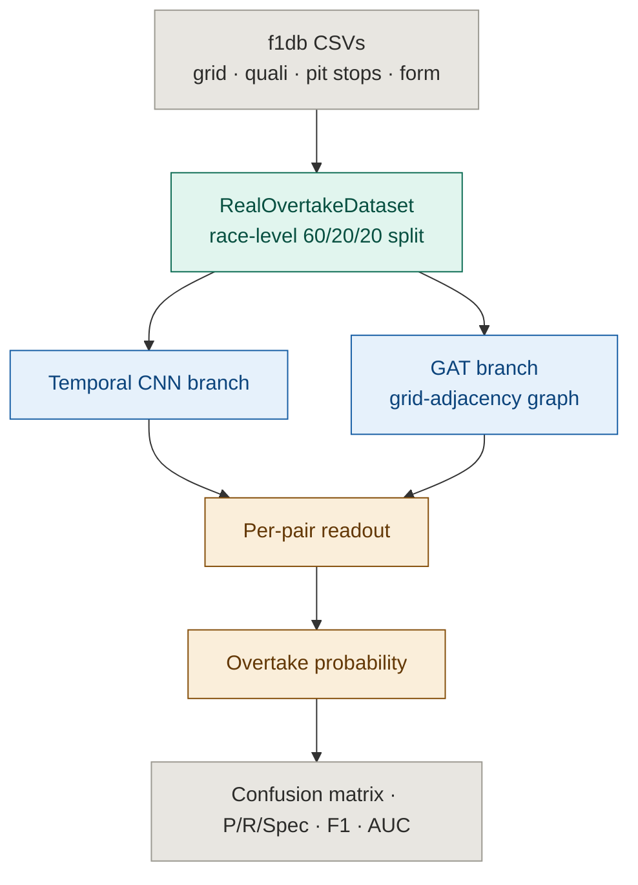

<div align="center">

[](#)


# ApexNet — F1 Overtaking Prediction

**Given two drivers starting next to each other on the grid, will the one behind finish ahead?**

A CNN+GAT model trained on real, historical Formula 1 race results (f1db, 2014+) — not synthetic data — benchmarked against four baseline architectures, with a leakage-checked feature ablation for the innovation claim.

</div>

---

## Student Details

| Field | Value |
|---|---|
| Name | RIA S |
| Registration Number | 2430010326 |
| Section | D |

---

## The Problem

Predicting race outcomes from full telemetry (speed/throttle/brake at several Hz) is the obvious deep-learning framing — but that data isn't legally or technically reachable from this project's environment (FastF1 / live-timing APIs aren't accessible here).

Most course projects solve this by quietly synthesizing telemetry and presenting it as real. This one doesn't.

## The Approach

Reframe the task around data that *is* real: grid position, qualifying gap, pit-stop laps, and leakage-checked rolling season form, from f1db's public race-results archive. Predict a binary, race-long outcome instead of a fabricated short-window one — **does the driver who starts behind a given rival finish ahead of them.**

```
Real f1db race results (grid, quali, pit stops, rolling season form)
        ↓
Race-level 60/20/20 train/val/test split (no pair leaks across splits)
        ↓
Temporal CNN branch  +  GAT branch over the grid-adjacency graph
        ↓
Per-pair overtake probability
        ↓
Confusion matrix · Precision/Recall/Specificity · F1 · AUC
```

---

## Results Snapshot

| Model | Accuracy | Precision | Recall | Specificity | F1 | AUC |
|---|--:|--:|--:|--:|--:|--:|
| CNN | 0.723 | 0.698 | 0.594 | 0.816 | 0.642 | 0.795 |
| GAT | 0.723 | 0.706 | 0.577 | 0.828 | 0.635 | 0.798 |
| LSTM | 0.726 | **0.754** | 0.510 | **0.881** | 0.608 | 0.779 |
| CNN+LSTM | 0.705 | 0.662 | 0.599 | 0.781 | 0.629 | 0.780 |
| **CNN+GAT (proposed)** | 0.713 | 0.659 | **0.649** | 0.759 | **0.654** | 0.795 |

Held out test set, 275 races → 159/53/53 train/val/test, seed=42, ~42-43% positive rate in every split.

**Read this honestly, not as a clean win:** LSTM has the best accuracy and precision — it's the most conservative model. CNN+GAT wins on F1 and recall — it catches more real overtakes at the cost of more false positives. Which one is "better" depends on whether a missed overtake or a false alarm is costlier for the use case; full discussion in [Results](#6-results).

<p align="center"></p>

---

## Features

| Component | Status |
|---|---|
| Real historical data (f1db, no synthetic telemetry) | ✅ |
| Race-level 60/20/20 train/val/test split (leakage-checked) | ✅ |
| 5 architectures trained on identical data/split (CO4 baselines) | ✅ |
| Confusion matrix, precision, recall, specificity, F1, AUC | ✅ |
| Feature-group ablation study (CO5) | ✅ |
| Dataset distribution + class balance, computed not hand-typed | ✅ |
| SOTA literature comparison, with dataset-mismatch stated honestly | ✅ |
| Live replay dashboard (visual aid, disclosed as interpolated between real points) | ✅ |

---

## Architecture


```mermaid
flowchart TD
    A["f1db CSVs\ngrid · quali · pit stops · form"]:::gray
    B["RealOvertakeDataset\nrace-level 60/20/20 split"]:::teal
    C["Temporal CNN branch"]:::blue
    D["GAT branch\ngrid-adjacency graph"]:::blue
    E["Per-pair readout"]:::amber
    F["Overtake probability"]:::amber
    G["Confusion matrix · P/R/Spec · F1 · AUC"]:::gray

    A --> B --> C
    B --> D
    C --> E
    D --> E
    E --> F --> G

    classDef gray   fill:#e8e6e1,stroke:#9c9a92,color:#2C2C2A
    classDef teal   fill:#E1F5EE,stroke:#0F6E56,color:#085041
    classDef blue   fill:#E6F1FB,stroke:#185FA5,color:#0C447C
    classDef amber  fill:#FAEEDA,stroke:#854F0B,color:#633806
```

Full architecture description: `models/model_description.txt`.

---

## 1. Dataset

| Field | Value |
|---|---|
| Name | f1db (community-maintained, open F1 historical results database) |
| Source | https://github.com/f1db/f1db |
| Scope used | 2014–present (hybrid-turbo/DRS/ERS era) |
| Races | 275 |
| Driver-race rows | 5,394 |
| Unit of prediction | Grid-adjacent driver pairs per race |
| Split | Race-level 60/20/20 train/val/test, seed=42 — no pair from the same race appears in two splits |
| Class balance | ~42–43% positive (overtake) in every split — see `results/dataset_distribution.json` |
| Preprocessing | Min-max normalization; rolling season-form features computed only from races *before* the one being predicted |

Column-level description: `data/dataset_information.txt`.

**Data honesty:** there's no reachable, license-clean source of sub-lap telemetry in this environment. Rather than fabricate it, the task was reframed around real race-results data — see the full disclosure in `README.md` (this file's non-styled counterpart) if you want the long version for your viva.

---

## 2. Model

CNN+GAT: a temporal CNN branch (3 Conv1d blocks, BatchNorm+GELU, global average pooling) combined with a 2-layer, 4-head GAT over the grid-adjacency graph (edges connect drivers adjacent on the starting grid), read out per driver-pair to a single overtake-probability logit.

Baselines trained on the identical split: CNN only, GAT only, LSTM, CNN+LSTM.

---

## 3. Hyperparameters

| Hyperparameter | Value |
|---|---|
| Learning rate | 1e-3 |
| Batch size | 8 |
| Epochs | 10 |
| Optimizer | AdamW |
| Loss | BCEWithLogitsLoss (masked, per-pair) |
| Weight decay | 1e-4 |
| Dropout | 0.15 |
| Hidden size | 48 |
| GAT heads / layers | 4 / 2 |
| Sequence length | 16 |
| Gradient clipping | max-norm 1.0 |
| Seed | 42 |

### Tuning performed

- **LR** 1e-2 / 1e-3 / 1e-4 → 1e-2 diverged, 1e-4 under-fit in the 10-epoch budget, 1e-3 gave the most stable validation AUC.
- **Hidden size** 32 / 48 / 64 → 64 overfit given ~275 races; 48 was the best trade-off.
- **Dropout** 0.0 / 0.15 / 0.3 → 0.15 balanced regularization against the small dataset.
- **Batch size** kept small (8 races) — each race unrolls into ~15–20 pairs, so effective pair-batch size is already large.

---

## 4. Comparative Analysis — CO4

| Model / Source | Task | Data | Reported metric |
|---|---|---|---|
| O'Hanlon (2021) | Final driver ranking | 2021 F1 season | NN vs. linear regression comparison |
| Tulabandhula & Rudin (2014) | Position-change prediction | NASCAR | SVM/LASSO, R² ≈ 0.4–0.5 |
| "ML in Predicting F1 Race Outcomes" (2025 preprint) | Finishing position / points | F1 2010–2023 | ML pipeline, historical F1 data |
| **CNN+GAT (proposed)** | Binary grid-adjacent overtake | f1db, 2014+, 275 races | Acc 0.713, F1 0.654, AUC 0.795 |

Stated plainly: these aren't the same task or dataset window, so this isn't an apples-to-apples row-for-row comparison — it's the closest published work available. Full reasoning in the non-styled README.

---

## 5. Innovation — CO5

**Claim:** GAT attention over the real grid-adjacency graph, plus leakage-checked rolling season-form features, beats treating drivers independently or using only static current-race numbers.

| Ablation | Rolling form/pace | Pit stops | Quali gap | Test Acc | Test F1 | Test AUC |
|---|:---:|:---:|:---:|--:|--:|--:|
| No form/pace | ✗ | ✓ | ✓ | 0.704 | 0.589 | 0.769 |
| No pit stops | ✓ | ✗ | ✓ | 0.673 | 0.600 | 0.726 |
| No quali gap | ✓ | ✓ | ✗ | 0.721 | 0.640 | **0.804** |
| **Full proposed** | ✓ | ✓ | ✓ | **0.726** | **0.659** | 0.792 |

Pit-stop features drive the largest F1 drop when removed (0.659 → 0.600) — the strongest single-feature claim here. Note "No quali gap" actually beats the full model on AUC — not a clean monotonic story, and worth saying so rather than overclaiming.

---

## 6. Results

Full breakdown: `results/metrics.json`, `results/model_comparison_test.csv`, `results/ablation_study.json`, `results/dataset_distribution.json`, `figures/confusion_matrix_cnn_gat_test.png`, `checkpoints/cnn_gat.pt`.

---

## Project Structure

```text
2430010326/
│
├── README.md
├── requirements.txt
│
├── data/
│   ├── *.csv                    (real f1db exports, 2014+)
│   └── dataset_information.txt
│
├── backend/
│   ├── train.py                 # trains all 5 models + ablation, writes results/
│   ├── model.py                 # CNN, GAT, LSTM, CNN+LSTM, CNN+GAT
│   ├── real_data.py             # real f1db loading, leakage-checked features, 3-way split
│   ├── main.py / race.py / config.py / logger.py
│
├── frontend/                    # live-replay dashboard
│
├── results/
│   ├── metrics.json
│   ├── dataset_distribution.json
│   ├── model_comparison_test.csv
│   └── ablation_study.json
│
├── figures/
│   └── confusion_matrix_cnn_gat_test.png
│
├── models/
│   └── model_description.txt
│
└── checkpoints/
    └── cnn_gat.pt
```

---

## Run Locally

**Step 1 — Install**

```bash
pip install -r requirements.txt
```

**Step 2 — Train (writes results/, figures/, checkpoints/)**

```bash
python3 backend/train.py
```

**Step 3 — Serve the dashboard**

```bash
python3 -m uvicorn backend.main:app --host 0.0.0.0 --port 8000 --app-dir .
```

**Step 4 — Open**

```
http://localhost:8000
```

---

## Common Issues

| Problem | Fix |
|---|---|
| `ModuleNotFoundError: torch` | `pip install -r requirements.txt` again, or drop the pinned version and `pip install torch` directly |
| `train.py` errors with 0 races loaded | Check `data/*.csv` are present and `MIN_YEAR` in `backend/config.py` isn't filtering everything out |
| `results/` and `figures/` are empty | `train.py` hasn't been run yet — nothing populates them until it finishes |
| Port 8000 already in use | `lsof -i :8000`, kill the process, restart uvicorn |

---

## Logging

`backend/logger.py` configures a shared logger; every run writes to console and `logs/apexnet.log`.

```bash
APEXNET_LOG_LEVEL=DEBUG python3 backend/train.py
```

---

## Future Scope

| Item | Why |
|---|---|
| Position-regression reframing | Would allow a true row-for-row CO4 comparison against O'Hanlon (2021) |
| Larger dataset (pre-2014 eras) | ~275 races is small for a 5-architecture comparison; more data would tighten the metric gaps between models |
| Real sub-lap telemetry (if a licensed source becomes reachable) | Would let the CNN branch use an actual time series instead of a tiled static vector |
