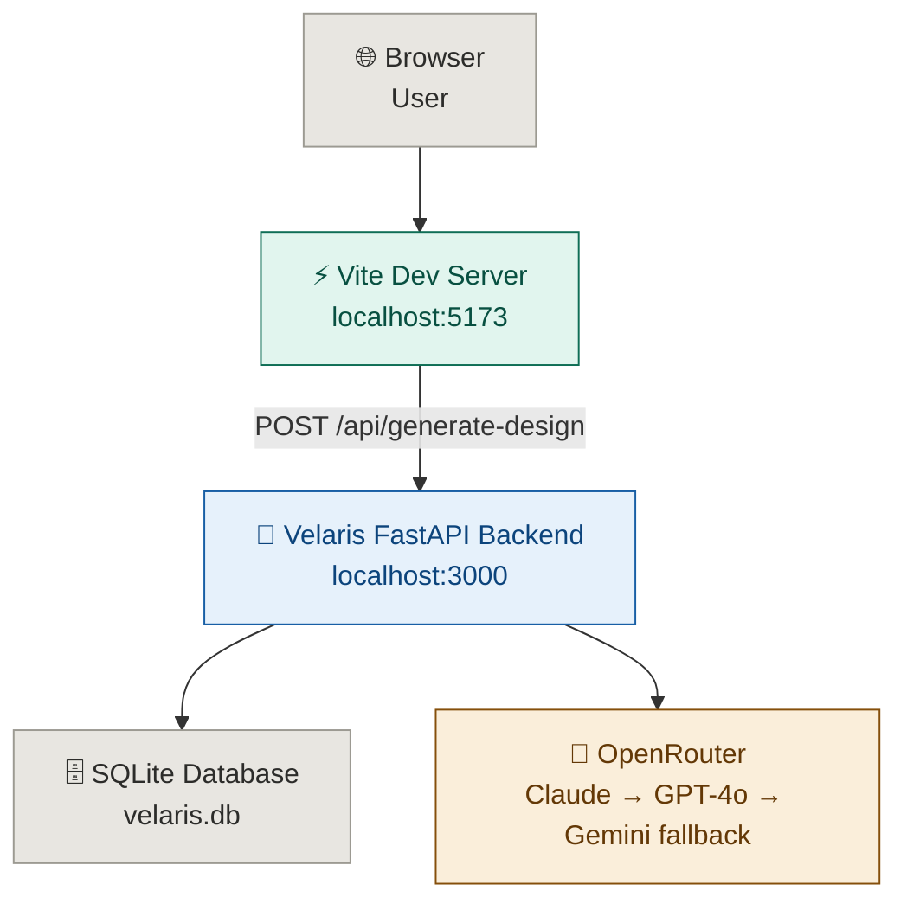

<div align="center">

[](https://github.com/ria0304/Velaris-From-Inspiration-to-Jewellery-Design)


# Velaris — From Inspiration to Jewellery Design

**Type it. Sketch it. Upload it. Get a jewellery design you can actually build.**

VELARIS AI transforms natural language descriptions, sketches, or inspiration photos into professional design concepts, manufacturer-ready spec sheets, and exportable PDFs — powered by a multi-model AI fallback chain.

</div>

---

## The Problem

Custom jewellery design is slow, expensive, and built on miscommunication.

**Customers** struggle to describe what they want clearly, visualise the final piece, or understand costs before committing.

**Jewellers** spend hours interpreting vague briefs, creating multiple drafts, and handling revisions — before a single piece is made.

---

## The Solution

VELARIS AI bridges the gap between a customer's idea and a jeweller's workflow.

A user inputs their idea in one of three ways:

- **Text** — describe the piece in plain language
- **Sketch** — upload a rough hand-drawn drawing
- **Photo** — upload an inspiration image

The system outputs:

- A **type-accurate visual concept** (ring, necklace, earrings, bracelet, brooch, tiara — each rendered differently)
- A **structured specification sheet** (type, metal, stone, cut, style, setting, occasion, sizing, cost breakdown)
- **Dynamic manufacturing notes** specific to the chosen metal, setting type, and complexity score
- An **exportable PDF** the jeweller can use to quote and manufacture

---

## Core User Flow

```
User input (text / sketch / photo)
        ↓
OpenRouter AI (Claude → GPT-4o → Gemini fallback chain)
        ↓
Structured spec + multi-view narrative
        ↓
Type-accurate SVG visualiser (Ring / Necklace / Earrings / Bracelet / Brooch / Tiara)
        ↓
Dynamic manufacturing notes (metal + setting + complexity)
        ↓
Exportable PDF → Jeweller
```

---

## Features

| Feature | Status |
|---|---|
| Text / sketch / photo input | ✅ |
| Multi-model AI fallback chain (Claude → GPT-4o → Gemini) | ✅ |
| Type-accurate SVG visualiser (6 jewelry types × 3 views) | ✅ |
| Structured spec sheet (metal, stone, cut, setting, occasion, sizing) | ✅ |
| Dynamic manufacturing notes (metal + setting + complexity) | ✅ |
| Cost breakdown (metal + stone + labour + markup) | ✅ |
| PDF export (ReportLab, full spec + multiview) | ✅ |
| Persistent saved designs (SQLite, survives restarts) | ✅ |
| Gifting advisor endpoint | ✅ |
| Trend intelligence endpoint | ✅ |

---

## Type-Accurate Visualiser

Every jewellery type renders a distinct silhouette across all three views (Front, Side, Artistic Angle):

| Type | Front | Side | Perspective |
|---|---|---|---|
| **Ring** | Band + crown + prongs | Band cross-section | 3/4 elliptical band |
| **Necklace / Pendant** | Chain arc + pendant drop | Thin profile + bail depth | Draped chain + pendant |
| **Earrings** | Matched pair + ear posts | Single drop edge-on | Both at 3/4 angle |
| **Bracelet** | Oval bangle + top stone | Bangle cross-section | Perspective ellipse |
| **Brooch** | Starburst + pin back | Flat body profile | Sculptural starburst |
| **Tiara** | Arched band + rising spires | Height profile | Curved crown perspective |

Gem colour, metal tone, setting accent stones, and gemstone cut shape are layered on top of the type-specific silhouette — so a Ruby Oval Halo Brooch looks nothing like a Diamond Round Prong Ring.

---

## Dynamic Manufacturing Notes

Manufacturing notes are generated per-design based on three signals:

- **`castingNotes`** — driven by metal choice (Platinum vs Rose Gold vs Sterling Silver etc.) and jewelry type (earrings cast in matched pairs; brooches include a pin-back structure; tiaras require multi-section soldering)
- **`settingNotes`** — driven by setting type (Pavé labour intensity vs Tension precision requirements vs Bezel protection vs Halo stone sequencing) and stone type
- **`polishingNotes`** — driven by metal (Platinum vs Gold vs Silver finishing behaviour) and complexity/price tier

No two designs produce the same manufacturing brief.

---

## Deep Learning Modules

Four models sit in front of / alongside the LLM design-generation flow, each independently trainable, independently testable, and each fails soft — the app runs exactly as it did before if any given model isn't trained yet. All four share one pattern: `backend/ml/*.py` holds inference-only wrappers, `ml_training/*.py` holds the offline training pipeline (not deployed, not run by the server).

### Module 1 — Jewelry Type Classification (CNN)

Fine-tuned EfficientNet-B0 classifying a sketch/photo upload as **Ring, Necklace, Bracelet,** or **Earrings**, wired into `design.py::resolve_design_type()` as a pre-processing step ahead of the LLM call. Falls back to keyword-based text extraction below 55% confidence, or when the prompt names a type the model wasn't trained on (Brooch/Pendant/Tiara — no labeled data exists for those).

**Dataset:** [`sidd707/jewelry-design-dataset`](https://huggingface.co/datasets/sidd707/jewelry-design-dataset) (HF, MIT licensed), ~6,100 images across the four classes. Ring is the smallest class (~230 images) — worth flagging as a limitation.

```bash
python ml_training/prepare_dataset.py
python ml_training/train_type_classifier.py
python ml_training/evaluate.py
```

### Module 2 — Style Recognition (CNN)

Same EfficientNet-B0 transfer-learning setup, but binary: **Traditional/Temple vs Modern/Minimal.** The original 5-class plan (Vintage/Minimal/Temple/Modern/Luxury) was cut down because there's no dataset with clean style labels — style is subjective even to human labelers. Instead, `prepare_style_dataset.py` derives *weak* labels by keyword-matching the caption text that ships with the Module 1 dataset (distant supervision) rather than hand-labeling images. Call this out explicitly as weak labeling in your report — it's a legitimate technique, but not the same as human-verified ground truth, and it's honestly the best "limitations" discussion (CO5) of the four modules.

```bash
python ml_training/prepare_dataset.py         # if not already done
python ml_training/prepare_style_dataset.py
python ml_training/train_style_classifier.py
python ml_training/evaluate_style.py
```

### Module 3 — Gemstone Detection (YOLOv8)

Object detection (bounding boxes, not just a label) for **Diamond, Emerald, Ruby, Sapphire**, fine-tuned from a pretrained YOLOv8n on a Roboflow gemstone dataset — already labeled with bounding boxes, no manual annotation needed. Wired into `design.py::resolve_gemstone_hint()`: detected stones above 35% confidence get passed to the LLM as a hint ("prefer these stones unless the user's text says otherwise") rather than letting it guess stones from the image alone.

```bash
# fill in your Roboflow API key + project details in prepare_gemstone_dataset.py first
python ml_training/prepare_gemstone_dataset.py
python ml_training/train_gemstone_detector.py
```

ultralytics logs its own precision/recall/mAP + confusion matrix per run under `runs/detect/gemstone/` — no separate eval script needed for this one.

### Module 4 — Similarity Search (CLIP)

No training — a pretrained CLIP ViT (`openai/clip-vit-base-patch32`) embeds a reference pool of jewelry images once (`build_similarity_index.py`), then embeds the user's upload at request time and returns the closest matches by cosine similarity. Cheapest module to run, and the one that most directly demonstrates transformers-in-practice (CLIP's image encoder is a Vision Transformer) for the report.

```bash
python ml_training/prepare_dataset.py         # if not already done, reuses the same image pool
python ml_training/build_similarity_index.py
```

### Setup + checking what's trained

```bash
pip install -r requirements.txt -r requirements-ml.txt
```

None of the four checkpoints are committed (too large for git). Train whichever you want locally — each module activates automatically once its checkpoint/weights/index file shows up under `backend/ml/checkpoints/`, no code changes needed. Check what's currently trained via:

```bash
curl http://localhost:3000/api/health
```

which reports `type_classifier`, `style_classifier`, `gemstone_detector`, and `similarity_search` as booleans.

**Try any of them standalone**, independent of the full design-generation flow:

```bash
curl -X POST http://localhost:3000/api/classify-type    -H "Content-Type: application/json" -d '{"image": "<base64>"}'
curl -X POST http://localhost:3000/api/classify-style   -H "Content-Type: application/json" -d '{"image": "<base64>"}'
curl -X POST http://localhost:3000/api/detect-gemstones -H "Content-Type: application/json" -d '{"image": "<base64>"}'
curl -X POST http://localhost:3000/api/find-similar     -H "Content-Type: application/json" -d '{"image": "<base64>", "top_k": 5}'
```

---

## Architecture


```mermaid
flowchart TD
    A["🌐 Browser\nUser"]:::gray
    B["⚡ Vite Dev Server\nlocalhost:5173"]:::teal
    C["🐍 Velaris FastAPI Backend\nlocalhost:3000"]:::blue
    D["🗄️ SQLite Database\nvelaris.db"]:::gray
    E["🤖 OpenRouter\nClaude → GPT-4o → Gemini fallback"]:::amber

    A --> B
    B -->|"POST /api/generate-design"| C
    C --> D
    C --> E

    classDef gray   fill:#e8e6e1,stroke:#9c9a92,color:#2C2C2A
    classDef teal   fill:#E1F5EE,stroke:#0F6E56,color:#085041
    classDef blue   fill:#E6F1FB,stroke:#185FA5,color:#0C447C
    classDef amber  fill:#FAEEDA,stroke:#854F0B,color:#633806
```

---

## Tech Stack

**Frontend**
- React 19 + TypeScript + Vite
- Tailwind CSS

**Backend**
- FastAPI (Python)
- SQLite via `sqlite3` stdlib (WAL mode, persistent JSON blob storage)
- OpenRouter multi-model fallback chain: `claude-sonnet-4.5` → `gpt-4o` → `gemini-2.5-flash`
- ReportLab for PDF generation
- Dockerized

---

## Project Structure

```
Velaris-From-Inspiration-to-Jewellery-Design/
│
├── backend/                          # All Python server-side logic
│   ├── __init__.py                   # Package marker
│   ├── advisor.py                    # Gifting advisor endpoint
│   ├── classify.py                   # Module 1 — standalone /api/classify-type endpoint
│   ├── style.py                      # Module 2 — standalone /api/classify-style endpoint
│   ├── detect.py                     # Module 3 — standalone /api/detect-gemstones endpoint
│   ├── similar.py                    # Module 4 — standalone /api/find-similar endpoint
│   ├── config.py                     # Env vars + OpenRouter model fallback chain
│   ├── design.py                     # Core design generation + dynamic manufacturing notes
│   ├── json_schemas.py               # JSON schema for structured LLM output
│   ├── ml/                           # Modules 1-4 — inference only, no training code here
│   │   ├── __init__.py
│   │   ├── type_classifier.py        # Module 1 — EfficientNet-B0, jewelry type
│   │   ├── style_classifier.py       # Module 2 — EfficientNet-B0, binary style
│   │   ├── gemstone_detector.py      # Module 3 — YOLOv8, gemstone bounding boxes
│   │   ├── similarity_search.py      # Module 4 — CLIP embeddings, cosine similarity
│   │   └── checkpoints/              # Trained weights/indices go here (gitignored, train locally)
│   ├── openrouter_client.py          # Multi-model fallback client (Claude → GPT-4o → Gemini)
│   ├── pdf_generator.py              # ReportLab PDF export (full spec + multiview)
│   ├── schemas.py                    # Pydantic request/response models
│   ├── sketch_processor.py           # Classical CV sketch preprocessing (OpenCV)
│   ├── storage.py                    # SQLite persistent store (WAL mode)
│   └── trends.py                     # Trend intelligence endpoint
│
├── ml_training/                      # Modules 1-4 — offline training pipeline (not deployed)
│   ├── prepare_dataset.py            # Module 1 — downloads + splits the HF jewelry dataset
│   ├── train_type_classifier.py      # Module 1 — two-phase EfficientNet-B0 transfer learning
│   ├── evaluate.py                   # Module 1 — test-set metrics + confusion matrix
│   ├── prepare_style_dataset.py      # Module 2 — weak-labels a binary style split from captions
│   ├── train_style_classifier.py     # Module 2 — same transfer-learning approach as Module 1
│   ├── evaluate_style.py             # Module 2 — test-set metrics + confusion matrix
│   ├── prepare_gemstone_dataset.py   # Module 3 — downloads a labeled set from Roboflow
│   ├── train_gemstone_detector.py    # Module 3 — fine-tunes YOLOv8n
│   ├── build_similarity_index.py     # Module 4 — embeds a reference pool with CLIP (no training)
│   ├── data/ , data_style/ , data_gemstone/   # Downloaded datasets (gitignored)
│   └── results/                      # Training logs, classification reports, confusion matrices
│
├── src/                              # React + TypeScript frontend
│   ├── assets/
│   │   └── images/
│   │       └── luxury_agate_backdrop_1782161136573.jpg   # App background asset
│   ├── components/
│   │   └── JewelryBlueprint.tsx      # Type-aware SVG visualiser (6 types × 3 views)
│   ├── App.tsx                       # All views: input flow, results, advisor, trends, saved designs
│   ├── index.css                     # Global styles
│   ├── main.tsx                      # React entry point
│   └── types.ts                      # Shared TypeScript types
│
├── .env.example                      # Environment variable template
├── .gitignore
├── index.html                        # Vite HTML entry point
├── main.py                           # FastAPI entry point — mounts all backend routers
├── package.json                      # Node dependencies + Vite scripts
├── requirements.txt                  # Python dependencies
├── tsconfig.json                     # TypeScript compiler config
└── vite.config.ts                    # Vite config — proxies /api/* to localhost:3000
```

---

## Run Locally

Both the frontend and backend must run simultaneously. The Vite dev server proxies all `/api/*` requests to `localhost:3000` automatically — no CORS config needed.

**Step 1 — Clone and install**

```bash
git clone https://github.com/ria0304/Velaris-From-Inspiration-to-Jewellery-Design.git
cd Velaris-From-Inspiration-to-Jewellery-Design
```

**Step 2 — Set up environment**

```bash
cp .env.example .env
```

Open `.env` and set your OpenRouter API key (get one free at https://openrouter.ai/keys):

```env
OPENROUTER_API_KEY=sk-or-xxxxxxxxxxxxxxxx
```

**Step 3 — Start the backend** (Terminal 1)

```bash
# Install Python dependencies (one-time)
pip install -r requirements.txt

# Start FastAPI on port 3000
uvicorn main:app --reload --port 3000
```

You should see:
```
INFO:     Uvicorn running on http://0.0.0.0:3000 (Press CTRL+C to quit)
INFO:     Application startup complete.
```

The SQLite database (`velaris.db`) is created automatically on first run.

**Step 4 — Start the frontend** (Terminal 2)

```bash
# Install Node dependencies (one-time)
npm install

# Start Vite dev server on port 5173
npm run dev
```

**Step 5 — Open the app**

```
http://localhost:5173
```

The frontend talks to the backend via the Vite proxy — all `/api/*` calls go to `localhost:3000` without any extra config.

---

## Verify the backend is working

```bash
# open in your browser:
http://localhost:3000/docs
```

```bash
curl -X POST http://localhost:3000/api/generate-design \
  -H "Content-Type: application/json" \
  -d '{
    "prompt": "A simple emerald ring with gold band",
    "inputType": "text",
    "style": "Contemporary Minimalist",
    "budget": "Balanced"
  }'
```

---

## Common Issues

| Problem | Fix |
|---|---|
| `OPENROUTER_API_KEY` not set | Add it to `.env` and restart the backend |
| Port 3000 already in use | `lsof -i :3000` to find the process, kill it, then restart |
| Frontend shows blank / API errors | Make sure the backend is running first |
| `ModuleNotFoundError` on startup | Run `pip install -r requirements.txt` again |
| `velaris.db` permission error | Check write permissions in the project directory |

---

## Deployment

Local-only. The app runs locally — see **Run Locally** above. `velaris.db` is gitignored and created on first backend startup.

---

## Environment Variables

| Variable | Required | Description |
|---|---|---|
| `OPENROUTER_API_KEY` | ✅ | API key from [openrouter.ai](https://openrouter.ai/keys) |
| `MODEL_FALLBACK_CHAIN` | No | Comma-separated model slugs (default: `google/gemini-2.0-flash-lite,meta-llama/llama-3.2-3b-instruct,mistralai/mistral-7b-instruct,google/gemini-2.5-flash` — see `backend/config.py`) |
| `ALLOWED_ORIGINS` | No | CORS allowlist (default: `http://localhost:5173,http://localhost:3000`) |
| `APP_URL` | No | Hosted URL for OpenRouter referer header (default: `http://localhost:3000`) |
| `VELARIS_DB_PATH` | No | Path to SQLite DB file (default: `velaris.db`). Set to `/app/data/velaris.db` in Docker. |


---
flowchart TD

subgraph group_client["Browser client"]
  node_frontend_entry["Vite entry<br/>React bootstrap<br/>[main.tsx]"]
  node_app["Application UI<br/>React app<br/>[App.tsx]"]
  node_blueprint["Jewelry blueprint<br/>SVG renderer"]
end

subgraph group_api["FastAPI serving"]
  node_api_entry{{"API composition<br/>FastAPI entry<br/>[main.py]"}}
  node_contracts["API contracts<br/>Pydantic schemas<br/>[schemas.py]"]
  node_ml_facades["Standalone ML APIs<br/>FastAPI façades<br/>[classify.py]"]
  node_storage["Design storage<br/>SQLite JSON repository<br/>[storage.py]"]
  node_database[("Local design store<br/>SQLite WAL database<br/>[velaris.db]")]
  node_pdf["PDF generator<br/>ReportLab export<br/>[pdf_generator.py]"]
end

subgraph group_ai["Design intelligence"]
  node_design["Design orchestration<br/>generation pipeline<br/>[design.py]"]
  node_llm_schema["LLM output schema<br/>structured constraints<br/>[json_schemas.py]"]
  node_openrouter["OpenRouter client<br/>LLM provider adapter"]
  node_sketch["Sketch preprocessing<br/>classical CV"]
end

subgraph group_ml["ML enrichment"]
  node_ml_inference["Image ML inference<br/>type, style, gems, similarity"]
  node_type_classifier["Type classifier<br/>image inference<br/>[type_classifier.py]"]
  node_gemstone_detector["Gemstone detector<br/>YOLO inference"]
end

subgraph group_offline["Offline ML pipeline"]
  node_offline_training["Model training<br/>offline training scripts"]
  node_offline_index["Similarity index build<br/>offline indexing"]
end

node_frontend_entry -->|"boots"| node_app
node_app -->|"/api via Vite proxy"| node_api_entry
node_api_entry -->|"validates"| node_contracts
node_api_entry -->|"generation route"| node_design
node_api_entry -->|"save/load routes"| node_storage
node_api_entry -->|"export route"| node_pdf
node_api_entry -->|"ML routes"| node_ml_facades
node_design -->|"sketch input"| node_sketch
node_design -->|"image hints"| node_ml_inference
node_ml_inference -->|"classifies type"| node_type_classifier
node_ml_inference -->|"localizes gems"| node_gemstone_detector
node_design -->|"constrains output"| node_llm_schema
node_design -->|"generates specification"| node_openrouter
node_design -->|"canonical package"| node_pdf
node_design -->|"canonical package"| node_storage
node_app -->|"renders design package"| node_blueprint
node_storage -->|"persists JSON"| node_database
node_offline_training -.->|"produces checkpoints"| node_type_classifier
node_offline_training -.->|"produces checkpoints"| node_gemstone_detector
node_offline_index -.->|"provides retrieval index"| node_ml_inference

click node_frontend_entry "https://github.com/ria0304/velaris-from-inspiration-to-jewellery-design/blob/main/src/main.tsx"
click node_app "https://github.com/ria0304/velaris-from-inspiration-to-jewellery-design/blob/main/src/App.tsx"
click node_blueprint "https://github.com/ria0304/velaris-from-inspiration-to-jewellery-design/blob/main/src/components/JewelryBlueprint.tsx"
click node_api_entry "https://github.com/ria0304/velaris-from-inspiration-to-jewellery-design/blob/main/main.py"
click node_contracts "https://github.com/ria0304/velaris-from-inspiration-to-jewellery-design/blob/main/backend/schemas.py"
click node_design "https://github.com/ria0304/velaris-from-inspiration-to-jewellery-design/blob/main/backend/design.py"
click node_llm_schema "https://github.com/ria0304/velaris-from-inspiration-to-jewellery-design/blob/main/backend/json_schemas.py"
click node_openrouter "https://github.com/ria0304/velaris-from-inspiration-to-jewellery-design/blob/main/backend/openrouter_client.py"
click node_sketch "https://github.com/ria0304/velaris-from-inspiration-to-jewellery-design/blob/main/backend/sketch_processor.py"
click node_type_classifier "https://github.com/ria0304/velaris-from-inspiration-to-jewellery-design/blob/main/backend/ml/type_classifier.py"
click node_gemstone_detector "https://github.com/ria0304/velaris-from-inspiration-to-jewellery-design/blob/main/backend/ml/gemstone_detector.py"
click node_ml_facades "https://github.com/ria0304/velaris-from-inspiration-to-jewellery-design/blob/main/backend/classify.py"
click node_storage "https://github.com/ria0304/velaris-from-inspiration-to-jewellery-design/blob/main/backend/storage.py"
click node_database "https://github.com/ria0304/velaris-from-inspiration-to-jewellery-design/blob/main/velaris.db"
click node_pdf "https://github.com/ria0304/velaris-from-inspiration-to-jewellery-design/blob/main/backend/pdf_generator.py"
click node_offline_training "https://github.com/ria0304/velaris-from-inspiration-to-jewellery-design/blob/main/ml_training/train_type_classifier.py"
click node_offline_index "https://github.com/ria0304/velaris-from-inspiration-to-jewellery-design/blob/main/ml_training/build_similarity_index.py"

classDef toneNeutral fill:#f8fafc,stroke:#334155,stroke-width:1.5px,color:#0f172a
classDef toneBlue fill:#dbeafe,stroke:#2563eb,stroke-width:1.5px,color:#172554
classDef toneAmber fill:#fef3c7,stroke:#d97706,stroke-width:1.5px,color:#78350f
classDef toneMint fill:#dcfce7,stroke:#16a34a,stroke-width:1.5px,color:#14532d
classDef toneRose fill:#ffe4e6,stroke:#e11d48,stroke-width:1.5px,color:#881337
classDef toneIndigo fill:#e0e7ff,stroke:#4f46e5,stroke-width:1.5px,color:#312e81
classDef toneTeal fill:#ccfbf1,stroke:#0f766e,stroke-width:1.5px,color:#134e4a
class node_frontend_entry,node_app,node_blueprint toneBlue
class node_api_entry,node_contracts,node_ml_facades,node_storage,node_database,node_pdf toneAmber
class node_design,node_llm_schema,node_openrouter,node_sketch toneMint
class node_ml_inference,node_type_classifier,node_gemstone_detector toneRose
class node_offline_training,node_offline_index toneIndigo
---

## API Endpoints

| Method | Endpoint | Description |
|---|---|---|
| `POST` | `/api/generate-design` | Generate a full design package from text/sketch/photo |
| `POST` | `/api/classify-type` | **Module 1** — classify a jewelry image as Ring/Necklace/Bracelet/Earrings, with per-class confidence |
| `POST` | `/api/classify-style` | **Module 2** — classify a jewelry image as Traditional/Modern |
| `POST` | `/api/detect-gemstones` | **Module 3** — detect + localize Diamond/Emerald/Ruby/Sapphire, returns bounding boxes |
| `POST` | `/api/find-similar` | **Module 4** — CLIP embedding search over a reference pool, returns top-k similar images |
| `POST` | `/api/save-design` | Save a design to SQLite |
| `GET` | `/api/saved-designs` | List all saved designs (newest first) |
| `DELETE` | `/api/saved-designs/{id}` | Delete a saved design |
| `POST` | `/api/export-pdf` | Export a saved design as a base64-encoded PDF |
| `POST` | `/api/jewellery-advisor` | Gifting advisor recommendations |
| `GET` | `/api/trends` | Trend intelligence data |

---

## Future Scope

| Feature | Why |
|---|---|
| Virtual try-on | Overlay design on a user photo using AR |
| Similar item shopping | Suggest where to buy something similar |
| React Native app | Camera access makes uploads much easier |
| Barcode scanner | Check if a piece fits your aesthetic before buying |

| RDS Postgres | Replace SQLite for production-scale concurrent traffic |
