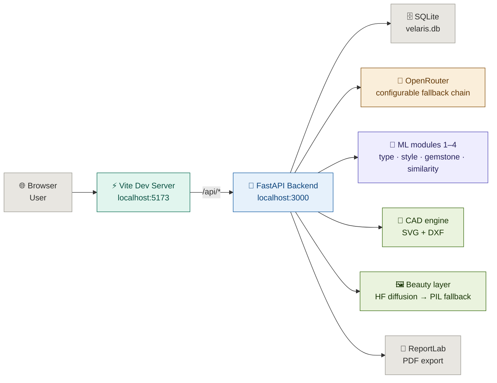

<div align="center">

[](https://github.com/ria0304/Velaris-From-Inspiration-to-Jewellery-Design)


# Velaris — From Inspiration to Jewellery Design

**Type it. Sketch it. Upload it. Get a jewellery design you can actually build.**

VELARIS AI transforms natural language descriptions, sketches, or inspiration photos into design concepts, jeweller-ready spec sheets, parametric CAD views, and exportable PDFs — powered by a multi-model AI fallback chain and four deep learning modules.

</div>

---

## The Problem

Custom jewellery design is slow, expensive, and built on miscommunication.

**Customers** struggle to describe what they want clearly, visualise the final piece, or understand costs before committing.

**Jewellers** spend hours interpreting vague briefs, creating multiple drafts, and handling revisions — before a single piece is made.

---

## The Solution

VELARIS AI bridges the gap between a customer's idea and a jeweller's workflow.

A user inputs their idea in one of three ways:

- **Text** — describe the piece in plain language
- **Sketch** — upload a rough hand-drawn drawing
- **Photo** — upload an inspiration image

The system outputs:

- A **type-accurate visual concept** (ring, necklace, pendant, earrings, bracelet, brooch, tiara — each rendered differently, in four views)
- A **structured specification sheet** (type, metal, stone, cut, style, setting, occasion, sizing, cost breakdown)
- **Dynamic manufacturing notes** specific to the chosen metal, setting type, and complexity score
- A **presentation board** combining CAD vector views with realistic renders
- An **exportable PDF** the jeweller can use to quote and manufacture, with a minimal DXF attached

---

## Core User Flow

```
User input (text / sketch / photo)
        ↓
Pre-processing (photo / sketch only, each fails soft)
  · Module 1 — type classifier (CNN)
  · Module 3 — gemstone detector (YOLOv8 / OWL-ViT) → stone hint
        ↓
OpenRouter LLM (configurable fallback chain)
        ↓
Structured spec + multi-view narrative + cost breakdown
        ↓
Dynamic manufacturing notes (metal + setting + complexity)
        ↓
Parametric CAD engine → SVG views (front / side / perspective / back)
        ↓
Presentation board (CAD vectors + realistic renders)
        ↓
Exportable PDF (+ DXF attachment) → Jeweller
```

---

## Features

| Feature | Status |
|---|---|
| Text / sketch / photo input | ✅ |
| Multi-model AI fallback chain via OpenRouter (configurable) | ✅ |
| Parametric CAD visualiser (7 jewellery types × 4 views, deterministic SVG) | ✅ |
| Realistic PNG previews (procedural PIL renderer) | ✅ |
| Optional diffusion "beauty" renders (Hugging Face FLUX → PIL fallback, disk-cached) | ✅ |
| Presentation board (hero, front/back, view strip, gem + spec rail) | ✅ |
| Structured spec sheet (metal, stone, cut, setting, occasion, sizing) | ✅ |
| Dynamic manufacturing notes (metal + setting + complexity) | ✅ |
| Cost breakdown (metal + stone + labour + markup) | ✅ |
| PDF export (ReportLab: multiview, realistic previews, technical specs, CAD data) | ✅ |
| Minimal DXF export (band + stone circles at true mm size, embedded in the PDF) | ✅ |
| Persistent saved designs (SQLite, survives restarts) | ✅ |
| Gifting advisor endpoint | ✅ |
| Trend intelligence endpoint | ✅ |
| Deep learning modules 1–4 (fail-soft, train locally) | ✅ |

---

## Visualiser

The visualiser is a deterministic **parametric CAD engine** (`backend/cad/`). One shared set of millimetre-space parameters — stone size, shape, band width, setting — drives every view, so front, side, perspective and back stay geometrically consistent with each other and with the spec. There is no LLM call in the primary path.

Every jewellery type renders a distinct silhouette:

| Type | Front | Side | Perspective |
|---|---|---|---|
| **Ring** | Band + crown + prongs | Band cross-section | 3/4 elliptical band |
| **Necklace / Pendant** | Chain arc + pendant drop | Thin profile + bail depth | Draped chain + pendant |
| **Earrings** | Matched pair + ear posts | Single drop edge-on | Both at 3/4 angle |
| **Bracelet** | Oval bangle + top stone | Bangle cross-section | Perspective ellipse |
| **Brooch** | Starburst + pin back | Flat body profile | Sculptural starburst |
| **Tiara** | Arched band + rising spires | Height profile | Curved crown perspective |

A fourth **back view** (pin stem, hinge, catch) is available for the presentation board and PDF. Brooches with an animal motif get a dedicated illustration (currently a phoenix with layered wings, hooked beak and taloned legs).

Gem colour, metal tone, setting accents (halo, bezel) and gemstone cut shape are layered on top of the type-specific silhouette, so a Ruby Oval Halo Brooch looks nothing like a Diamond Round Prong Ring.

**Render chain for previews and the presentation board:**

1. Hugging Face text-to-image (`black-forest-labs/FLUX.1-schnell` by default) — only if `HUGGINGFACE_API_KEY` is set
2. Procedural PIL renderer — always available, no key needed

Results are cached on disk by a hash of the spec, so an identical design is never generated twice. `/api/render-beauty` reports which path produced the image in the `X-Render-Source` header (`diffusion`, `diffusion-cached`, or `procedural`).

If the CAD engine itself raises, `/api/generate-svg` falls back to a free-model OpenRouter chain and finally to a static template.

---

## Dynamic Manufacturing Notes

Manufacturing notes are generated per-design based on three signals:

- **`castingNotes`** — driven by metal choice (Platinum vs Rose Gold vs Sterling Silver etc.) and jewellery type (earrings cast in matched pairs; brooches include a pin-back structure; tiaras require multi-section soldering)
- **`settingNotes`** — driven by setting type (Pavé labour intensity vs Tension precision requirements vs Bezel protection vs Halo stone sequencing) and stone type
- **`polishingNotes`** — driven by metal (Platinum vs Gold vs Silver finishing behaviour) and complexity/price tier

No two designs produce the same manufacturing brief.

---

## Deep Learning Modules

Four models sit alongside the LLM design-generation flow, each independently trainable, independently testable, and each fails soft — the app runs exactly as it did before if any given model isn't trained yet. All four share one pattern: `backend/ml/*.py` holds inference-only wrappers, `ml_training/*.py` holds the offline training pipeline (not deployed, not run by the server).

**Where each module plugs in:**

| Module | Feeds `/api/generate-design`? | Standalone endpoint |
|---|---|---|
| 1 — Type classifier | ✅ via `resolve_design_type()` | `/api/classify-type` |
| 2 — Style classifier | ❌ | `/api/classify-style` |
| 3 — Gemstone detector | ✅ via `resolve_gemstone_hint()` | `/api/detect-gemstones` |
| 4 — Similarity search | ❌ | `/api/find-similar` |

Modules 2 and 4 are currently API-only: nothing in the design flow or the web UI calls them yet.

### Module 1 — Jewellery Type Classification (CNN)

Fine-tuned EfficientNet-B0 classifying a sketch/photo upload as **Ring, Necklace, Bracelet,** or **Earrings**, wired into `design.py::resolve_design_type()` as a pre-processing step ahead of the LLM call. Falls back to keyword-based text extraction below 55% confidence, or when the prompt names a type the model wasn't trained on (Brooch/Pendant/Tiara — no labeled data exists for those).

**Dataset:** [`sidd707/jewelry-design-dataset`](https://huggingface.co/datasets/sidd707/jewelry-design-dataset) (HF, MIT licensed), ~6,100 images across the four classes. Ring is the smallest class (~230 images) — a class-imbalance limitation.

```bash
python ml_training/prepare_dataset.py
python ml_training/train_type_classifier.py
python ml_training/evaluate.py
```

### Module 2 — Style Recognition (CNN)

Same EfficientNet-B0 transfer-learning setup, but binary: **Traditional/Temple vs Modern/Minimal.** The original 5-class plan (Vintage/Minimal/Temple/Modern/Luxury) was cut down because there's no dataset with clean style labels — style is subjective even to human labelers. Instead, `prepare_style_dataset.py` derives *weak* labels by keyword-matching the caption text that ships with the Module 1 dataset (distant supervision) rather than hand-labeling images. This is a legitimate technique, but it is not human-verified ground truth: treat reported accuracy as indicative, not definitive.

```bash
python ml_training/prepare_dataset.py         # if not already done
python ml_training/prepare_style_dataset.py
python ml_training/train_style_classifier.py
python ml_training/evaluate_style.py
```

### Module 3 — Gemstone Detection (YOLOv8 + OWL-ViT fallback)

Object detection (bounding boxes, not just a label) for **Diamond, Emerald, Ruby, Sapphire**. Two backends, in strict preference order:

1. **YOLOv8n, fine-tuned** on a Roboflow gemstone dataset — used when weights exist at `backend/ml/checkpoints/gemstone_detector.pt`. Highest accuracy on jewellery imagery.
2. **OWL-ViT, zero-shot** (`google/owlvit-base-patch32`) — label-free fallback that prompts a frozen vision-language detector with the four stone names. Works with zero training data, but is weaker than a fine-tuned YOLO on niche imagery.

Both return the same `[{label, confidence, box}]` contract. The confidence threshold is backend-aware: `0.35` for YOLO, `0.15` for OWL-ViT (override with `GEMSTONE_DETECTOR_CONF`). Detected stones above the threshold are passed to the LLM as a hint ("prefer these stones unless the user's text says otherwise") via `design.py::resolve_gemstone_hint()`, rather than letting it guess stones from the image alone.

```bash
# fill in your Roboflow API key + project details in prepare_gemstone_dataset.py first
python ml_training/prepare_gemstone_dataset.py
python ml_training/train_gemstone_detector.py
```

ultralytics logs its own precision/recall/mAP + confusion matrix per run under `runs/detect/gemstone/` — no separate eval script needed for this one.

### Module 4 — Similarity Search (CLIP)

No training — a pretrained CLIP ViT (`openai/clip-vit-base-patch32`) embeds a reference pool of jewellery images once (`build_similarity_index.py`), then embeds the user's upload at request time and returns the closest matches by cosine similarity. Cheapest module to run, and the one that most directly demonstrates transformers-in-practice (CLIP's image encoder is a Vision Transformer).

```bash
python ml_training/prepare_dataset.py         # if not already done, reuses the same image pool
python ml_training/build_similarity_index.py
```

### Setup + checking what's trained

Inference dependencies (torch, torchvision, ultralytics, transformers) are in `requirements.txt`. `requirements-ml.txt` adds the **training-only** extras (scikit-learn, matplotlib, roboflow):

```bash
pip install -r requirements.txt                          # run the app
pip install -r requirements.txt -r requirements-ml.txt   # also train models
```

None of the checkpoints are committed (too large for git). Train whichever you want locally — each module activates automatically once its checkpoint/weights/index file shows up under `backend/ml/checkpoints/`, no code changes needed. Check what's currently active via:

```bash
curl http://localhost:3000/api/health
```

which reports `type_classifier`, `style_classifier`, `gemstone_detector`, and `similarity_search` as booleans (plus `sketch_processor`).

**Try any of them standalone**, independent of the full design-generation flow:

```bash
curl -X POST http://localhost:3000/api/classify-type    -H "Content-Type: application/json" -d '{"image": "<base64>"}'
curl -X POST http://localhost:3000/api/classify-style   -H "Content-Type: application/json" -d '{"image": "<base64>"}'
curl -X POST http://localhost:3000/api/detect-gemstones -H "Content-Type: application/json" -d '{"image": "<base64>"}'
curl -X POST http://localhost:3000/api/find-similar     -H "Content-Type: application/json" -d '{"image": "<base64>", "top_k": 5}'
```

---

## Architecture


```mermaid
flowchart LR
    A["🌐 Browser<br/>User"]:::gray
    B["⚡ Vite Dev Server<br/>localhost:5173"]:::teal
    C["🐍 FastAPI Backend<br/>localhost:3000"]:::blue
    D["🗄️ SQLite<br/>velaris.db"]:::gray
    E["🤖 OpenRouter<br/>configurable fallback chain"]:::amber
    F["🧠 ML modules 1–4<br/>type · style · gemstone · similarity"]:::purple
    G["📐 CAD engine<br/>SVG + DXF"]:::green
    H["🖼️ Beauty layer<br/>HF diffusion → PIL fallback"]:::green
    I["📄 ReportLab<br/>PDF export"]:::gray

    A --> B
    B -->|"/api/*"| C
    C --> D
    C --> E
    C --> F
    C --> G
    C --> H
    C --> I

    classDef gray   fill:#e8e6e1,stroke:#9c9a92,color:#2C2C2A
    classDef teal   fill:#E1F5EE,stroke:#0F6E56,color:#085041
    classDef blue   fill:#E6F1FB,stroke:#185FA5,color:#0C447C
    classDef amber  fill:#FAEEDA,stroke:#854F0B,color:#633806
    classDef purple fill:#EEEDFE,stroke:#534AB7,color:#26215C
    classDef green  fill:#EAF3DE,stroke:#3B6D11,color:#173404
```

---

## Tech Stack

**Frontend**
- React 19 + TypeScript + Vite
- Tailwind CSS 4
- DOMPurify (all backend-supplied SVG is sanitized before rendering)

**Backend**
- FastAPI (Python), with slowapi rate limiting
- SQLite via `sqlite3` stdlib (WAL mode, persistent JSON blob storage)
- OpenRouter multi-model fallback chain (default: `gemini-2.0-flash-lite` → `llama-3.2-3b-instruct` → `mistral-7b-instruct` → `gemini-2.5-flash`, overridable via `MODEL_FALLBACK_CHAIN`)
- PyTorch / torchvision (EfficientNet-B0), ultralytics (YOLOv8), transformers (CLIP, OWL-ViT)
- Pillow + OpenCV + svglib for rendering and image processing
- ReportLab + pypdf for PDF generation and DXF attachment

---

## Project Structure

```
Velaris-From-Inspiration-to-Jewellery-Design/
│
├── backend/                          # All Python server-side logic
│   ├── __init__.py                   # Package marker
│   ├── advisor.py                    # Gifting advisor endpoint
│   ├── classify.py                   # Module 1 — standalone /api/classify-type endpoint
│   ├── style.py                      # Module 2 — standalone /api/classify-style endpoint
│   ├── detect.py                     # Module 3 — standalone /api/detect-gemstones endpoint
│   ├── similar.py                    # Module 4 — standalone /api/find-similar endpoint
│   ├── config.py                     # Env vars + OpenRouter model fallback chain
│   ├── design.py                     # Core design generation + dynamic manufacturing notes
│   ├── json_schemas.py               # JSON schema for structured LLM output
│   ├── ml/                           # Modules 1-4 — inference only, no training code here
│   │   ├── __init__.py
│   │   ├── type_classifier.py        # Module 1 — EfficientNet-B0, jewellery type
│   │   ├── style_classifier.py       # Module 2 — EfficientNet-B0, binary style
│   │   ├── gemstone_detector.py      # Module 3 — YOLOv8 (fine-tuned) / OWL-ViT (zero-shot)
│   │   ├── similarity_search.py      # Module 4 — CLIP embeddings, cosine similarity
│   │   └── checkpoints/              # Trained weights/indices go here (gitignored, train locally)
│   ├── cad/                          # Parametric CAD engine
│   │   ├── __init__.py               # Shared mm-space params, SVG renderers, DXF export
│   │   └── router.py                 # /api/cad-svg, /api/cad-dxf
│   ├── render/                       # Realistic PNG renderer (procedural PIL)
│   │   ├── __init__.py
│   │   └── router.py                 # /api/render-realistic
│   ├── beauty/                       # Diffusion presentation renders + disk cache
│   │   ├── __init__.py               # HF text-to-image → PIL fallback
│   │   └── router.py                 # /api/render-beauty, /api/beauty-prompt
│   ├── presentation.py               # /api/presentation-board — composes CAD + renders + specs
│   ├── svg_generator.py              # /api/generate-svg — CAD first, LLM/template fallback
│   ├── openrouter_client.py          # Multi-model fallback client
│   ├── huggingface_client.py         # Legacy text-generation fallback (not currently called)
│   ├── pdf_generator.py              # ReportLab PDF export (multiview, previews, specs, DXF)
│   ├── schemas.py                    # Pydantic request/response models
│   ├── sketch_processor.py           # OpenCV sketch preprocessing (standalone /api/sketch-process)
│   ├── storage.py                    # SQLite persistent store (WAL mode)
│   └── trends.py                     # Trend intelligence endpoint
│
├── ml_training/                      # Modules 1-4 — offline training pipeline (not deployed)
│   ├── prepare_dataset.py            # Module 1 — downloads + splits the HF jewellery dataset
│   ├── train_type_classifier.py      # Module 1 — two-phase EfficientNet-B0 transfer learning
│   ├── evaluate.py                   # Module 1 — test-set metrics + confusion matrix
│   ├── prepare_style_dataset.py      # Module 2 — weak-labels a binary style split from captions
│   ├── train_style_classifier.py     # Module 2 — same transfer-learning approach as Module 1
│   ├── evaluate_style.py             # Module 2 — test-set metrics + confusion matrix
│   ├── prepare_gemstone_dataset.py   # Module 3 — downloads a labeled set from Roboflow
│   ├── train_gemstone_detector.py    # Module 3 — fine-tunes YOLOv8n
│   ├── build_similarity_index.py     # Module 4 — embeds a reference pool with CLIP (no training)
│   ├── data/ , data_style/ , data_gemstone/   # Downloaded datasets (gitignored)
│   └── results/                      # Training logs, classification reports, confusion matrices
│
├── src/                              # React + TypeScript frontend
│   ├── assets/
│   │   └── images/
│   │       └── luxury_agate_backdrop_1782161136573.jpg   # App background asset
│   ├── components/
│   │   ├── JewelryBlueprint.tsx      # CAD SVG viewer (Artistic / Front / Profile)
│   │   └── PresentationBoard.tsx     # Editorial board: hero, front/back, view strip, specs
│   ├── App.tsx                       # All views: input flow, results, advisor, trends, saved designs
│   ├── index.css                     # Global styles
│   ├── main.tsx                      # React entry point
│   ├── types.ts                      # Shared TypeScript types
│   └── vite-env.d.ts                 # Vite type shims
│
├── tests/
│   ├── test_smoke.py                 # Health + save/list/delete + PDF-missing (no keys, no checkpoints)
│   └── test_pipeline.py              # CAD / render / beauty / board / PDF, plus live ML tests
│
├── phoenix_brooch.pdf                # Sample PDF export
├── .env.example                      # Environment variable template
├── .gitignore
├── index.html                        # Vite HTML entry point
├── main.py                           # FastAPI entry point — mounts all backend routers
├── package.json                      # Node dependencies + Vite scripts
├── requirements.txt                  # Python runtime dependencies (incl. ML inference)
├── requirements-ml.txt               # Training-only dependencies
├── tsconfig.json                     # TypeScript compiler config
└── vite.config.ts                    # Vite config — proxies /api/* to localhost:3000
```

---

## Run Locally

Both the frontend and backend must run simultaneously. The Vite dev server proxies all `/api/*` requests to `localhost:3000` automatically — no CORS config needed.

**Step 1 — Clone and install**

```bash
git clone https://github.com/ria0304/Velaris-From-Inspiration-to-Jewellery-Design.git
cd Velaris-From-Inspiration-to-Jewellery-Design
```

**Step 2 — Set up environment**

```bash
cp .env.example .env
```

Open `.env` and set your OpenRouter API key (get one at https://openrouter.ai/keys):

```env
OPENROUTER_API_KEY=sk-or-xxxxxxxxxxxxxxxx
```

**Step 3 — Start the backend** (Terminal 1)

```bash
# Install Python dependencies (one-time)
pip install -r requirements.txt

# Start FastAPI on port 3000
uvicorn main:app --reload --port 3000
```

You should see:
```
INFO:     Uvicorn running on http://0.0.0.0:3000 (Press CTRL+C to quit)
INFO:     Application startup complete.
```

The SQLite database (`velaris.db`) is created automatically on first run. Without trained checkpoints the ML modules log a warning and stay inactive — that is expected.

**Step 4 — Start the frontend** (Terminal 2)

```bash
# Install Node dependencies (one-time)
npm install

# Start Vite dev server on port 5173
npm run dev
```

**Step 5 — Open the app**

```
http://localhost:5173
```

The frontend talks to the backend via the Vite proxy — all `/api/*` calls go to `localhost:3000` without any extra config.

---

## Verify the backend is working

```bash
# open in your browser:
http://localhost:3000/docs
```

```bash
curl http://localhost:3000/api/health
```

```bash
curl -X POST http://localhost:3000/api/generate-design \
  -H "Content-Type: application/json" \
  -d '{
    "prompt": "A simple emerald ring with gold band",
    "inputType": "text",
    "style": "Contemporary Minimalist",
    "budget": "Balanced"
  }'
```

**Run the tests**

```bash
pip install pytest

# No API keys and no trained models needed
pytest tests/test_smoke.py

# CAD / render / beauty / board / PDF tests only
pytest tests/test_pipeline.py -k "not live and not ml_health and not gemstone_hint"
```

The remaining tests in `tests/test_pipeline.py` (`*_live`, `test_ml_health_flags`, `test_gemstone_hint_flows_to_design`) assert that the ML modules are active and read sample images from `ml_training/data/`, so they only pass after you have trained the models and downloaded the dataset locally.

---

## Common Issues

| Problem | Fix |
|---|---|
| `OPENROUTER_API_KEY` not set | Add it to `.env` and restart the backend |
| Port 3000 already in use | `lsof -i :3000` to find the process, kill it, then restart |
| Frontend shows blank / API errors | Make sure the backend is running first |
| `ModuleNotFoundError` on startup | Run `pip install -r requirements.txt` again |
| `velaris.db` permission error | Check write permissions in the project directory |
| ML module shows `false` in `/api/health` | Expected until you train it (or, for Module 3, until OWL-ViT can download its weights) — see **Deep Learning Modules** |
| Preview images look procedural, not photographic | Set `HUGGINGFACE_API_KEY` to enable diffusion renders; without it the PIL renderer is used by design |
| Mermaid diagram looks cut off on GitHub | Use the zoom-out / pan controls on the diagram, or open the README in full-screen view |

---

## Deployment

Local-only. The app runs locally — see **Run Locally** above. `velaris.db` is gitignored and created on first backend startup. There is no Dockerfile in this repository.

---

## Environment Variables

| Variable | Required | Description |
|---|---|---|
| `OPENROUTER_API_KEY` | ✅ | API key from [openrouter.ai](https://openrouter.ai/keys) |
| `MODEL_FALLBACK_CHAIN` | No | Comma-separated OpenRouter model slugs (default: `google/gemini-2.0-flash-lite,meta-llama/llama-3.2-3b-instruct,mistralai/mistral-7b-instruct,google/gemini-2.5-flash` — see `backend/config.py`) |
| `ALLOWED_ORIGINS` | No | CORS allowlist (default: `http://localhost:5173,http://localhost:3000`) |
| `APP_URL` | No | Hosted URL for OpenRouter referer header (default: `http://localhost:3000`) |
| `VELARIS_DB_PATH` | No | Path to SQLite DB file (default: `velaris.db`) |
| `HUGGINGFACE_API_KEY` | No | Enables diffusion "beauty" renders. Without it, previews use the procedural PIL renderer |
| `BEAUTY_HF_MODEL` | No | Text-to-image model (default: `black-forest-labs/FLUX.1-schnell`) |
| `BEAUTY_CACHE_DIR` | No | Disk cache for rendered images (default: `/tmp/velaris_beauty`) |
| `TYPE_CLASSIFIER_CHECKPOINT` / `TYPE_CLASSIFIER_CLASSES` | No | Module 1 paths (default: `backend/ml/checkpoints/`) |
| `STYLE_CLASSIFIER_CHECKPOINT` / `STYLE_CLASSIFIER_CLASSES` | No | Module 2 paths (default: `backend/ml/checkpoints/`) |
| `GEMSTONE_DETECTOR_WEIGHTS` | No | Module 3 YOLO weights path (default: `backend/ml/checkpoints/gemstone_detector.pt`) |
| `GEMSTONE_DETECTOR_CONF` | No | Module 3 confidence threshold. If unset: `0.35` for YOLO, `0.15` for OWL-ViT |
| `GEMSTONE_OWL_MODEL` | No | Module 3 zero-shot model (default: `google/owlvit-base-patch32`) |
| `SIMILARITY_INDEX_EMBEDDINGS` / `SIMILARITY_INDEX_METADATA` | No | Module 4 index paths (default: `backend/ml/checkpoints/`) |

---

## API Endpoints

**Design and storage**

| Method | Endpoint | Description |
|---|---|---|
| `POST` | `/api/generate-design` | Generate a full design package from text/sketch/photo |
| `POST` | `/api/save-design` | Save a design to SQLite (rejects payloads over 2 MB) |
| `GET` | `/api/saved-designs` | List all saved designs (newest first) |
| `DELETE` | `/api/saved-designs/{id}` | Delete a saved design |
| `POST` | `/api/export-pdf` | Export a saved design as a base64-encoded PDF (rate-limited to 20/min) |
| `POST` | `/api/jewellery-advisor` | Gifting advisor recommendations |
| `GET` | `/api/trends` | Trend intelligence data |
| `GET` | `/api/health` | Service status and which ML modules are active |

**Visuals and CAD**

| Method | Endpoint | Description |
|---|---|---|
| `POST` | `/api/generate-svg` | Per-view SVG. Parametric CAD first; LLM / static template only as a fallback |
| `POST` | `/api/cad-svg` | Deterministic CAD SVG plus derived mm parameters |
| `POST` | `/api/cad-dxf` | Minimal DXF (band + stone circles + label) as base64 |
| `POST` | `/api/render-realistic` | Procedural PIL PNG preview |
| `POST` | `/api/render-beauty` | Diffusion PNG with PIL fallback; source reported in `X-Render-Source` |
| `POST` | `/api/beauty-prompt` | The text-to-image prompt that would be used for a spec |
| `POST` | `/api/presentation-board` | One call returning all four views (SVG + PNG), features, gem table and specs |
| `POST` | `/api/sketch-process` | OpenCV edge/shape extraction from a sketch (standalone, not used by design generation) |

**Deep learning modules**

| Method | Endpoint | Description |
|---|---|---|
| `POST` | `/api/classify-type` | **Module 1** — classify a jewellery image as Ring/Necklace/Bracelet/Earrings, with per-class confidence |
| `POST` | `/api/classify-style` | **Module 2** — classify a jewellery image as Traditional/Modern |
| `POST` | `/api/detect-gemstones` | **Module 3** — detect + localize Diamond/Emerald/Ruby/Sapphire, returns bounding boxes and the backend used |
| `POST` | `/api/find-similar` | **Module 4** — CLIP embedding search over a reference pool, returns top-k similar images |

---

## Known Limitations

- **CAD output is schematic, not production CAD.** Ring geometry is the most complete. Other types use simplified silhouettes, and the DXF contains only a band circle, a stone circle and a text label at true mm scale. A jeweller still has to model the piece.
- **Dimensions and weights are estimates.** Stone radius is derived from carat using a round-brilliant approximation, and metal weight uses a flat density heuristic.
- **Only one motif is illustrated.** Brooches with a phoenix motif get a bespoke drawing; other motifs fall back to the generic starburst.
- **Module 1 covers four types.** Brooch, Pendant and Tiara are handled by keyword matching because no labeled training data exists for them. Ring is the smallest training class.
- **Module 2 uses weak labels.** Style labels are inferred from caption keywords, not verified by humans.
- **Modules 2 and 4 are not connected to the UI or to design generation.** They are exposed only through their own endpoints.
- **Sketch preprocessing is not in the design flow.** Sketches are sent to the vision-capable LLM as raw images; `/api/sketch-process` is a separate utility.
- **Small models in the default chain.** Later entries in the default fallback chain (3B and 7B models) may struggle with the strict JSON schema. If designs fail validation, reorder `MODEL_FALLBACK_CHAIN` toward stronger models.
- **Local only.** No Dockerfile, no hosted deployment.

---

## Future Scope

| Feature | Why |
|---|---|
| Virtual try-on | Overlay design on a user photo using AR |
| Similar item shopping | Suggest where to buy something similar |
| Wire Modules 2 and 4 into the UI | Style hints and "similar designs" panel |
| Full per-type CAD + richer DXF | Move from schematic views to jeweller-usable geometry |
| React Native app | Camera access makes uploads much easier |
| Barcode scanner | Check if a piece fits your aesthetic before buying |
| Docker + RDS Postgres | Reproducible deployment; replace SQLite for production-scale concurrent traffic |
